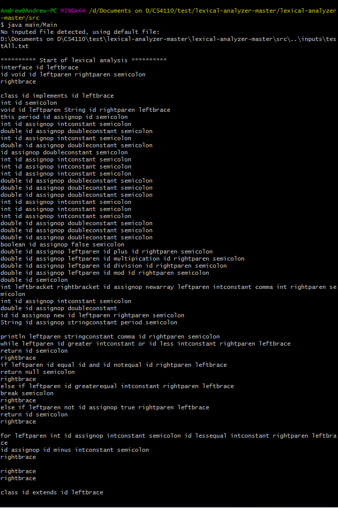
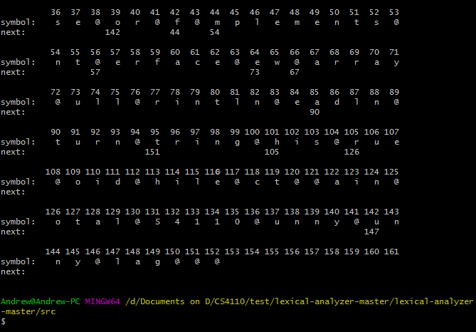

# Lexical Analyzer  
This program reads an input or text file, and tokenizes it according to the lexical conventions of the Toy programming language. 

# Authors  
[Andrew Sison](https://github.com/asison19)  
[Zach Martin](https://github.com/ZachMartin27) 

## Installation
First download or git clone the repository.  
To install, run the compile.bat file to compile the .java files. Alternatively, you can compile it using your terminal 
of choice. To do so, change directory to the "src" directory and type:  
javac -cp . main/Main.java  

The jflex lexical specification file is located in "src/lexicalAnalyzer", along with the java file it creates.  
To create the specification file, we used JFlex version 1.7.0 with JDK 1.8.  

## Usage  
To run the program, open a terminal and go to the "src" directory. Type  
"java main/Main"  
to run the default test file, or  
"java main/Main *fileName*"  
to test another input file. 
The terminal will then output the tokenized input file, as well as the Trie Table containing the identifiers.

## Troubleshooting
If there is a weird character on the top of the produced java file from the jflex spec, such as , save endcoding as UTF-8.  
Input (.in) files of the Toy "code" that needs to be compiled needs to be converted and encoded in UTF-8. The following endcodings won't work:  
ANSI, UTF-8-BOM, UCS-2-BE-BOM, UCS-2-LE-BOM  
Both ANSI, and UTF-8 can work with text (.txt) files.  

## Screenshots  
Default "testAll.txt" file.  
  
  
Testing "Sample.txt" file.  
  
  
